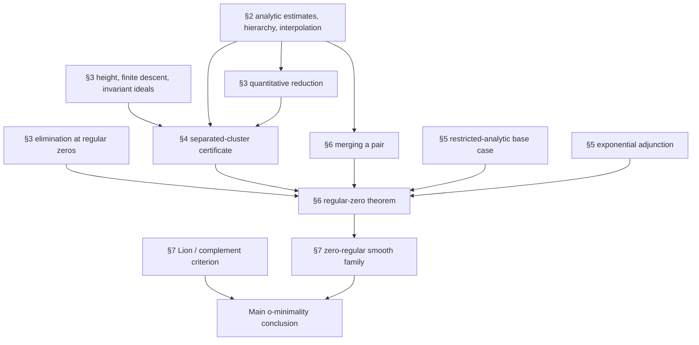

# Proof dependencies and formalization status

**This formalization proves the manuscript's main theorem.**
`AbelFormalization.mainTheorem : MainTheorem` supplies the proof from the
stated Abel hypotheses.

This report maps its compiled dependency chain and separately records
incomplete alternate routes that are not premises of the final theorem.

The source is `omin.tex`, dated 7 September 2026, Version 29. All manuscript line ranges below are inclusive and refer to the original file, whose SHA-256 is `f71eff9a0f971a8b17ac33c956b34313625c4e986bb9f9dff269ff1b869029d2`.

The mathlib survey concerns the pinned commit `e37d88a26f3791ed5a93daa1f949af1021b8d103`. “Not located” means that a directly matching theorem was not found by searches of filenames, declarations, documentation, and author/theorem names in this checkout. It is not a proof that no alternative derivation is possible from mathlib. Mathlib module names below identify actual inspected source files.

## Overall structure

The main theorem is stated at lines 131–141, label `thm:main`; its proof occupies lines 2441–2521. Its three conclusions have distinct dependencies:

| Conclusion | Proposed manuscript route | Formalization boundary |
|---|---|---|
| O-minimality of the ordered real field with `C0` | All regular fibers finite (`thm:regular`), Lion uniform fiber finiteness, then `lem:omin-criterion` | The complete restricted regular-zero induction and the concrete geometric/smooth/derivative-closed Abel family with 0-regularity are proved. The source-faithful Lion chain is complete: compactification, full-parameter selection, Lemmas 3--6, the critical-coefficient section construction, rectangular parametric Sard, Theorem 7' induction/counting, and the flat Fubini bridge prove uniform fiber finiteness from the four standing family hypotheses. Hence `IsAbel.hasUniformFiberFiniteness` has no residual premise. The final direct-trace route supplies the Sardian projection input internally, and the bounded deep Section 4 induction constructs the required projection-coherent tower. |
| Definability of exponential and the positive inverse | Recover the positive tail of `A` from `C0`; use injectivity and the Abel equation; extend exponential by field identities | Addressed by the first-order definitions in `Statement` and graph-witness proofs in `Definability`. This route does not assume o-minimality. |
| The inverse exceeds every fixed exponential iterate | In the manuscript: derivative bounds from `lem:estimates`, followed by iteration | Addressed independently in `Growth` and `Consequences`, using monotonicity and the inverse recurrence. The analytic estimates are not assumptions of this growth proof. |

The arrows describe mathematical dependencies; they are not Lean imports or completed proof edges. The double induction in §6 uses exponential adjunction at each fixed representative count and pair merging to decrease that count.

## Exact manuscript map

### Section 2: analytic input — lines 226–558

| Item | Statement / proof lines | Inputs and outstanding work |
|---|---|---|
| `eq:stirling` | Identity and explanation: 228–251 | Proved for every positive order in `Stirling`, with integer coefficients defined by the falling-factorial polynomial and its defining identity proved. |
| `lem:estimates` | 253–269 / 270–347 | Proved. The real limits and inverse inequalities are in `DerivativeBounds`, `LowerDerivativeBounds`, `HigherDerivatives`, `LogBound`, and `InverseEstimates`. `Orbit` and `OrbitBounds` supply the compact fundamental-interval arguments. `ComplexExtension`, `CompactComplexExtension`, `ComplexLog`, `ComplexLogIterates`, `ComplexCompatibility`, and `ComplexEstimates` construct compatible bounded holomorphic extensions for every fixed radius with the original quantifier order. `AnalyticEstimates` assembles the full lemma. |
| `lem:hierarchy` | 349–374 / 375–407 | Proved in `Hierarchy` and `FiniteHierarchy`, with the full sequence-sensitive lower gap, actual distance to integers, fixed logarithmic iterates, and singleton clusters. The first assertion is strengthened to every fixed real power; the unused upper bound on the largest time is omitted. |
| `lem:hermite` | 409–482 / 483–557 | Proved in `HermiteLemma` as `IsAbel.exists_hermiteLemma`. The fixed bounded open node domain, compatible complex branches, normalized coefficients, combined interpolation multiplicities, explicit jet expansions, and central constant coefficient are assembled in `AbelHermiteFamily`. The central identity uses the actual signed-Stirling coefficients and the actual divided-difference remainder, with all center, scale, and node variables independent. Both uniform growth exponents are strengthened to one. Full multivariable coefficient analyticity uses a Banach-valued contour family, analytic inversion, and bounded contour integration. Joint remainder holomorphy is expressed by complex Fréchet differentiability on the open product domain, including zero scale. |

### Section 3: algebraic elimination and lower bounds — lines 559–1329

The ring of convergent real-analytic germs, its dimension and regularity, compatible gradings, full weighted initial ideals, and full ordinary homogenization are introduced at lines 561–622. `AnalyticGerm` constructs the actual real-analytic germ ring as a subring of neighborhood germs, with analytic representatives and well-defined evaluation. `AnalyticGermLocal` proves locality, units, the maximal ideal, and the real residue field. The derivative and composition modules supply real-linear derivations and analytic pullbacks. `AnalyticGermDomain` proves the integral-domain property from the analytic identity principle. `AnalyticHadamard` uses a convergent shifted series to prove coordinate factorization; `AnalyticGermGenerators` identifies the maximal ideal with the coordinate-generated ideal. `AnalyticGermCotangent` identifies the actual cotangent space and proves its dimension is `p` over the residue field. `AnalyticGermDimensionLower` constructs a length-`p` prime chain, giving Krull dimension at least `p`. `AnalyticGermNoetherian` proves Noetherianity, regularity, and exact dimension in every finite dimension. Its convergent division input is proved through weighted coefficient Banach algebras, actual analytic representatives, regularizing coordinates, a derived strict radius shrink, and finite polynomial remainders with actual lower-dimensional germ coefficients. The one-variable proof also classifies every nonzero ideal by a coordinate power. `AnalyticGermNoetherianConsequences` supplies the dimension and regularity implications used after Noetherianity is proved. `AnalyticGermPolynomial` proves the faithful polynomial-coordinate embedding. `AnalyticGermPolynomialExtraction` proves the separate maximum-height extraction assertion below. The scalar and finite lexicographic full initial ideals and literal full ordinary homogenization are constructed with all-element identities and height bounds. Identity-graded ideals in additive group rings are extended from their coefficient contractions, with height equality for the actual finite-rank Laurent rings used by the paper. The actual polynomial translation, Laurent inversion, rescaling, homogeneous-image proof, and weight-zero contraction height comparison are proved in `CentralLaurentContraction`. `CentralPolynomialEquiv` and `CentralIdealConstruction` add the explicit signed-Stirling/time-shift algebra equivalence and the full central ideal with its height inequality. The global terminal deformation, component bridge, localized vector fields, triangular derivative extraction, simultaneous multiblock elimination, and retained-height transfer are now formalized. `OrdinaryHomogeneousDehomogenizationHeight` proves that `H=1` cannot lower the height of an arbitrary ordinary homogeneous ideal and combines this with the exact finite time-variable contraction loss. Formal power series alone do not supply analytic convergence.

| Item | Statement / proof lines | Inputs and outstanding work |
|---|---|---|
| `lem:height` | 626–644 / 645–742 | The polynomial contraction bound, actual germ polynomial extraction, full integer and finite lexicographic initial-height bounds, and full ordinary homogenization height are proved. Scalar and lexicographic operations use all ideal elements, with an actual homogeneous lifting theorem. Homogeneous-ideal extension is proved for identity-graded additive group rings; height equality is proved for `AddMonoidAlgebra R (Fin h → ℤ)`, covering the independent Laurent weights in the applications. For every ordinary homogeneous `C ⊂ B[H,t]`, the actual specialization `C|_{H=1}` has height at least that of `C`, without a saturation hypothesis; contracting `h` time variables then gives the manuscript's `height C - h` bound. |
| `lem:rank` | 744–769 / 770–814 | Proved by `exists_paperRankElimination` in `AnalyticRankElimination`. The actual equation map, original supported analytic coefficients, arbitrary smooth substitution on the projected open domain, actual surjective Fréchet derivative, exact retained-variable contraction, height at least `m+p`, finite analytic generator representatives, and one common smaller neighborhood are all present. The proof derives formal-minor positivity from the actual chain rule, uses the proved derivation-determinant height bound for the inverse-relation ideal, and evaluates only finitely many polynomial identities for arbitrary symbol assignments. |
| `lem:finite-descent` | 836–864 / 865–1013 | The actual finite-product, finite-length triangular iteration stabilizes permanently, and the field-case uniform homogeneous generator-degree theorem is proved from actual leading terms and weighted Hilbert functions. The Artinian bridge includes coefficientwise ideal-power components, a graded finite free cover, homogeneous kernels and induced-layer pullbacks, exact finite-weight quotient commutation, and a canonical identification of induced degree slices with component ranges. The residue-field pullbacks have a uniform generator bound, and `ArtinianBoundedGeneratorLifting` lifts uniformly bounded homogeneous generators over the original Artinian local ring. For the terminal rank-one polynomial ideal used later in the manuscript, `TerminalReindexedNoetherianDescent` proves the complete localization, contraction, saturated principal-quotient induction, and permanent stabilization over every Noetherian coefficient ring with a finite Krull-dimension bound. The broader arbitrary finitely generated graded-module formulation is not separately assembled as one theorem. |
| `eq:J` and its setup | 1015–1031 | Proved algebraically. The exact signed-Stirling coefficient identities, polynomial-parameter logarithmic derivations, bounded block vector fields, Lie recurrence, simultaneous global equivalence, positive block multigrading, and block index split are present. `TerminalGlobalParameterDeformation` and `TerminalBlockParameterSpecialization` prove the exact global-component/parameter-coefficient bridge and preservation by every terminal block field. |
| `lem:terminal` | 1033–1042 / 1043–1117 | The qualitative finite multiblock algebraic conclusion is proved. The terminal fields pass through the simultaneous localization, triangular identities yield stability under every higher partial derivative, and multivariate derivative extension removes the higher variables. The transported global multigrading then removes the Laurent variables. `TerminalGlobalAlgebraicElimination` gives the retained-variable extension identity from the manuscript's global hypotheses, and `TerminalGlobalHeightReduction` proves the resulting retained-contraction height inequality. |
| Central-ideal construction `𝔠(I)` | 1121–1197 | Proved algebraically in `CentralLaurentContraction`, `CentralPolynomialEquiv`, and `CentralIdealConstruction`: actual preliminary translation, full least lexicographic initial ideal, Laurent localization, rescaling, weight-zero contraction, explicit signed-Stirling block automorphisms, time translation, composition into the full central ideal, recovery by comap, and the required height inequality. Terminal invariance is now connected to the global construction; quantitative evaluation belongs to `lem:transfer`. |
| `lem:transfer` | 1199–1233 / 1234–1328 | Proved through `QuantitativeTransfer`, `TransferInitialCertificate`, `TransferJetSubstitution`, `RealTransferJetSubstitution`, `RealQuantitativeTransferAssembly`, and `FiniteSupportCoefficientPerturbation`. These modules construct the finite central certificate, exact real-jet substitution, analytic representative control, superpolynomial error bounds, and inverse-power lower-bound transfer. |

### Section 4: separated clusters — lines 1330–1752

| Item | Statement / proof lines | Inputs and outstanding work |
|---|---|---|
| Evaluation conventions and block ring | 1335–1381 | Track interpolation coefficients before the first logarithm, ordinary derivatives afterward, bounded germ coordinates, and a vector of fixed iterate counts. |
| `prop:separated` | 1383–1424 / 1425–1751 | Proved. The one-cluster algebraic certificate, Hermite blockification, analytic representatives, top-prefix transport, individual and simultaneous quantitative compatibility, bottom terminal localization, canonical diagonal separation data, and all-cluster backward propagation are assembled into the normalized separated contradiction with the manuscript's quantifier order. |

The final certificate is restricted to `Λ ∩ Γ_N`; it does not assert that this intersection is infinite. Its finite case is vacuous. The completed global induction handles the complementary case.

### Section 5: regular zeros and exponential adjunction — lines 1753–1992

| Item | Statement / proof lines | Inputs and outstanding work |
|---|---|---|
| Expression class, domain, and assertion `P(m,q)` | 1755–1827 | Formalized by the restricted source, box, Abel-jet, expression-base, and finite exponential-tower APIs. Analytic coefficients, positive domains, auxiliary variables, differentiation closure, and level quantification are actual functions and propositions. |
| `eq:graph` and `eq:equation-scaling` | Graph/scaling construction: 1829–1868 | Proved for explicit and implicit scalar graphs, simultaneous finite-dimensional implicit graphs, exponential graphs, and nonzero equation scaling. `RestrictedFixedIterateShiftGraph` proves the allowed iterate-shift equation has positive vertical derivative and preserves regular zeros locally. |
| `lem:exp` | 1870–1872 / 1873–1977 | Proved in the restricted adjunction modules. The project constructs the closed auxiliary curve, generic squared-distance critical system, regular arcs and normalized cofactor flow, finite critical components, comparison finiteness, graph lift, and the resulting exponential-level induction. |
| Base case `P(0,0)` and then `P(0,q)` | 1979–1991 | Proved in `RestrictedBaseZeroCase` without importing restricted-analytic o-minimality as an assumption. Analytic-germ elimination forces bounded parameters to the origin, and the unit-augmented Jacobian ideal gives a monic specialization controlling auxiliary variables. `restrictedRegularZeroFiniteForRepresentativeCount_zero_all` then applies exponential adjunction to obtain every `P(0,q)`. |

### Section 6: merging and global induction — lines 1993–2243

| Item | Statement / proof lines | Inputs and outstanding work |
|---|---|---|
| `lem:shift` | 1998–2030 / 2031–2053 | The unique bounded shift, tail smoothness, exact equation, decay estimate, and positive iterate derivative are proved. For every fixed exceptional offset, the maintained construction supplies the exact graph coordinate, graph equation, enlarged-box membership, and arbitrary-depth derivative substitution with an explicit positive common denominator. The simultaneous vector graph system is differentiable, its vertical Fréchet derivative is explicitly the positive diagonal continuous-linear equivalence, and the finite implicit graph theorem gives the exact regular-zero equivalence. |
| `lem:pair` | 2055–2074 / 2075–2157 | The nearest-integer finite selection, fixed pair and integer, exact logarithmic displacement limit, nonlinear coordinate diffeomorphism, source pullback, injectivity, box convergence, domain restriction, regular-zero transport, finite coordinate exponential tower, and pullback of the old tower are proved. The exact infinite-set dichotomy yields either infinitely many separated indices or a strict near-integer subsequence inside the chosen infinite set. A selected `q + 2` sequence is explicitly transported to an injective `q + 1` flat graph sequence with enlarged-box convergence and eventual product-system regular zeros. Finite support extraction deduplicates all exceptional offsets; their graph equations and derivative data lie in one common finite tower, and every exceptional derivative has a positive denominator-cleared numerator in a finite iterate tower. Generic finite common denominators and multivariable polynomial-family clearing are proved. The transformed and graph rows concatenate into one `Fin (n+N)` system with exact regular-zero transport. `RestrictedPairMergeCompressedSystemTower` extracts the finite jet support of every old row, assembles all exceptional denominator/numerator data and graph equations into one explicit common tower, and proves terminal membership of the full denominator-cleared augmented family. `RestrictedPairMergeDenominatorClearedRegularZero` identifies that generator union with a standard lower-count restricted Abel family, proves differentiability on the common positive domain, and proves that positive common-denominator scaling preserves regular zeros after graph substitution. `RestrictedPairMergeAugmentedRegularZero` combines the scaling theorem with the finite implicit graph theorem and the flat source/output equivalences, giving an exact pointwise regular-zero equivalence between the full cleared augmented system and the lower-count pullback. `RestrictedPairMergeLowerCountContradiction` applies this equivalence along the injective exceptional graph sequence, reindexes the finite output block to the exact lower-count square dimension, and invokes lower-count finiteness to rule out the pair branch. `RestrictedAllUnboundedSeparatedSetup` plugs that contradiction into the outer dichotomy, so the pair alternative is eliminated and the returned cluster subsequence has an infinite simultaneous-separation set. |
| `thm:regular` | 2159–2162 / 2163–2242 | Proved. The base row, exponential adjunction, bounded-coordinate reclassification, pair-merge contradiction, normalized separated branch, canonical diagonal restriction, and all-cluster backward propagation are assembled into `restrictedBaseRegularZeroFiniteForRepresentativeCount_all_of_canonicalBackwardPropagation`. |

### Section 7: o-minimality and growth — lines 2244–2521

| Item | Statement / proof lines | Inputs and outstanding work |
|---|---|---|
| `def:geometric` | 2250–2272 | `SmoothGeometricFamily` gives exact structures for algebraic/reciprocal/polynomial/affine closure, global smoothness, and coordinate-derivative closure. `AbelSmoothGenerators` defines every `C_r`, proves global analyticity, `C_r'(x)=2xC_{r+1}(x)`, and its affine-coordinate derivative formula. `AbelGeometricFamily` constructs the concrete localization of an explicit finite numerator syntax by everywhere-nonzero numerators and proves it geometric, globally smooth under `IsAbel`, coordinate-derivative closed, and inclusive of the required `C_r` generators. |
| `def:fiber-finiteness` | 2297–2310 | Exact `IsZeroRegularFunctionFamily` and `HasUniformFiberFiniteness` predicates distinguish targetwise finiteness from one uniform component bound, and the canonical separated contradiction proves concrete Abel-family 0-regularity. The source-faithful Lion route proves the standard carpet and flat compactification, the compact-limit and full-parameter selection arguments, the full Lemma 3 carpet, terminal-leaf finiteness, the quantitative Rolle reduction, and the dimension/counting induction. Lemma 4 is completed by the critical trace and coefficient-leaf construction, the logarithmic Lagrange joint-submersion calculation, rectangular parametric Sard, and implicit-chart transfer of rectangular Morse--Sard. The resulting generic Theorem 7' bound and Fubini flat-coordinate bridge prove that the four standing family hypotheses imply `HasUniformFiberFiniteness`; combined with concrete Abel-family 0-regularity, this gives `IsAbel.hasUniformFiberFiniteness` for every Abel function with no residual Lion premise. The older rank/minor Lagrange route remains exploratory infrastructure and is not used by the theorem. |
| `def:weak-structure` and `eq:DC` | 2322–2350 | The source's weak-structure, affine-section, closed-lift, and differentiability interfaces are represented. Projected-zero algebra, arbitrary affine sections, and the first-order envelope/reduct bridge are complete. The literal-zero Charbonnel closure now has an audited WS1--WS4 package, including arbitrary real-linear equivalences. Maxwell's universal replacement, compact separation comparison, and numeric strong-rank induction prove WS5 conditional on uniform fiber finiteness. Servi's closed projection theorem and Charbonnel §5.8's relative-closed/Fubini-null witness are proved without extra hypotheses. |
| `lem:omin-criterion` | 2353–2357 / 2358–2427 | The unconditional first-order reduct and projected-zero endpoint are formalized. The complement route includes WS1--WS5, now supplied for Abel families by the proved Lion UFF theorem, closed lifts, recursive moduli, Sardian constituents, trace descent, the boundary interface, Maxwell closure propagation, the §5.8 nullity witness, and automatic projection regularity. Wilkie's bounded map is formalized as a semialgebraically definable homeomorphism onto the open cube; bounded images and inverse images remain in the Charbonnel closure, closed sets have relatively closed bounded images, the map commutes with visible projection, and a finite relative compatible cover of the cube yields the ordinary complement after pullback. Section 4 retains enriched projected bases and carries the source partition clause through selector refinement to one-step projection-coherent covers; its intrinsic graph-cell branch is complete. The former all-dimensional refinement predicate is proved inconsistent at dimension zero and has been replaced by the source-correct retained deep induction, whose unary base and two successor clauses construct the required bounded hereditary tower in every dimension. Maxwell meagre-closure selection and closure-interior regularity are derived internally. Sections 5.4--5.6 use the closure of the infinite-fiber locus as exceptional base, repairing the source's false local-closedness claim. `CharbonnelSection57InfiniteFiberBridge` derives the §5.7 closure-fibre cardinality bound from stable-closure open localization. The two relative-localization bridges preserve a prescribed open region during lexicographic descent and convert open-base relative stability to the ambient witness, narrowing that alternate route's local residual to the explicit strict-refinement interface. The compiled endpoint instead uses direct positive-zero-trace category smallness. The separate §5.3 stationary-chain analysis still has rank-preserving successor/localization and chordal finite-prefix gaps, but that alternate route is not an additional premise. No interface used by the compiled endpoint is introduced as an axiom. |
| Application to `C_r` and regular fibers | 2441–2495 | The concrete `C_r` analytic and derivative identities, rational nowhere-zero quotient family, geometric/smooth/derivative closure, simultaneous denominator clearing, graph lift, restricted-base regular-zero theorem, numerator finiteness, concrete 0-regularity, and uniform fiber finiteness are proved. The completed direct-trace complement criterion and bounded deep Section 4 induction yield the o-minimality conclusion used by `AbelFormalization.mainTheorem`. |
| Definability conclusions | 2497–2504 | Recover `A` on a positive tail and invert its Abel relation. Formal graph-witness proofs are in `Definability`. |
| Growth conclusion | 2505–2521 | The independent proof in `Growth` replaces this derivative-based route. Its generic hypotheses are `Monotone T`, the recurrence `T(s+1)=exp(T(s))-1`, and one value at least two. `Inverse` and `Consequences` supply these from the Abel hypotheses. |

## External results and the inspected mathlib support

The following distinguishes reusable foundations from the exact external results required by the proposed proof. Citations identify the works and theorem references as given in the manuscript; no web citation is being used as a formal axiom.

| Required result | Use in the manuscript | Inspected mathlib support and remaining obligation |
|---|---|---|
| Szekeres, *Fractional iteration of exponentially growing functions*, §2, Lemma 1 | Existence argument before §2, lines 72–107 | The required existence is proved internally by `AbelFormalization.exists_isAbel` in `AbelExistence.lean`. A normally convergent logarithmic-defect series constructs a local positive analytic density; inverse iteration extends it globally; an analytic primitive normalized by its positive increment satisfies exactly `IsAbel`. The proof uses mathlib foundations and imports no Szekeres axiom. It does not assert the distinguished density asymptotic or uniqueness. See `ABEL_EXISTENCE_CONSTRUCTION.md`. |
| Holomorphic contour interpolation; de Boor, *Divided differences*, §§7 and 9 | `lem:hermite` | `Mathlib.Analysis.Complex.CauchyIntegral` and the analytic-function library provide foundations. The precise parameter-uniform confluent interpolant and remainder were not located. `Mathlib.RingTheory.Polynomial.Hermite.Basic` concerns Hermite polynomials, not this interpolation theorem. |
| Analytic-germ ring is regular Noetherian local of dimension `p` | Lines 561–564 and §3 throughout | The project proves this complete package for every finite `p` in `AnalyticGermNoetherian`. The proof constructs actual weighted convergent representatives, derives anisotropic shrinking from regularity, applies Neumann-series division in a complete coefficient Banach algebra, and reconstructs the remainder with lower-dimensional analytic-germ coefficients. Induction proves Noetherianity without a division or convergence hypothesis; the proved cotangent and prime-chain results then give regularity and exact dimension. Formal/adically complete series are not substituted for actual analytic germs. |
| Flat local dimension formula, Stacks Tag `00ON` | `lem:height` | The cited general formula was not needed. The project proves the required polynomial contraction, coefficient-extension, scalar and finite lexicographic initial-height, ordinary homogenization, Laurent extension, rescaling, and weight-zero contraction results directly from mathlib. It also proves the arbitrary-homogeneous `H=1` height comparison and the following finite-variable contraction loss. The explicit signed-Stirling/time-shift algebra equivalence completes the central-ideal height comparison. |
| Equicharacteristic Cohen structure theorem, Stacks Tag `032A` | Artinian case of `lem:finite-descent`, lines 865–879 | The current route avoids a coefficient-field section. Actual ideal-power quotient layers carry canonical residue-field actions and their dimensions sum to the original degree-piece length. Explicit coefficient-ideal generators give a homogeneous finite free ambient-layer cover whose kernel and every induced-layer pullback are homogeneous. Degree slices are canonically identified, residue-field pullback generators have a uniform bound, and compatible homogeneous representatives now lift that bound through the complete ideal-power filtration. Thus the Artinian local bounded-generation input is proved without invoking Cohen structure. |
| Maclagan, *Antichains of monomial ideals are finite*, Theorem 1.1 | Degree bound in `lem:finite-descent`, lines 888–921 | The project proves the reverse-inclusion WQO, fixed positive-weight count finiteness, uniform finite Dickson covers, actual module leading-term cancellation, the homogeneous leading-module/Hilbert correspondence, and the uniform field-case degree bound. The graded Artinian cover, quotient machinery, degree-slice identification, and compatible representative lift now transfer the bound to homogeneous polynomial submodules over the original Artinian local ring. |
| Milnor, *Morse Theory*, Theorem 6.6 | `lem:exp`, lines 1923–1930 | The project derives the needed generic squared-distance critical-point statement and its restricted adjunction application from mathlib's finite-dimensional differential topology and measure-theoretic critical-value tools. It is no longer imported as an assumption. |
| Denef–van den Dries real subanalytic result: o-minimality of `R_an` | Manuscript route for `P(0,0)`, lines 1979–1991 | No directly matching theorem was located in mathlib, but the formalization no longer needs it for the base row: `RestrictedBaseZeroCase` proves `P(0,0)` directly by analytic-germ algebra and zero isolation. |
| Lion, *Finitude simple et structures o-minimales*, Theorem 2 and Lemmas 3--6 | First step of `lem:omin-criterion`, line 2359 | Complete. Lemma 3 supplies carpeted leaves and zero-dimensional terminal finiteness. Lemma 4 constructs `δ_a`, `δ'_a`, the exact critical-coefficient trace and finite section-leaf cover, proves the logarithmic Lagrange parameter map jointly submersive, and applies rectangular parametric Sard plus implicit-chart Morse--Sard. Lemma 5 gives the exact full-fiber/partial-fiber component inequality with its rank premise derived from leaf submersivity. The numerical Theorem 7' induction assembles the recursive generic bound, and Lemma 6 combines full generic-parameter selection, flat-fiber projection, Fubini, and compact-limit transfer. `LionUniformFiberFinitenessTheorem` therefore proves UFF from the four standing family hypotheses and specializes it to every `IsAbel A` without a Lion premise. |
| Karpinski–MacIntyre complement theorem, Definition 1 and Theorem 1 | Final step of `lem:omin-criterion`, lines 2422–2426 | The exact Charbonnel syntax/ranks, closed base, WS1--WS4, WS5 under UFF, recursive moduli, Sardian nullity, trace descent, boundary interface, Servi closed lifts, Maxwell closure propagation, compact truncation, `P'_1`, the §5.3(a) moving-ball incidence bound, and the §5.8 closure-nullity witness are proved. Sardian certificates combine at arbitrary hidden depths; union, target closure, and zero-hidden-arity projection rank constructors are discharged. Wilkie 3.8's literal-zero radial constituent and its nested positive-level modulus are proved from the geometric-family and smoothness hypotheses alone. `CharbonnelSection53RelativeLexDescent` uses base-relative balls and proves local stability from a sufficient strict-refinement premise, separately from the stronger ambient endpoint. `CharbonnelSection53GlobalStratum` proves compact component supports, global count/minimum defect, and closed defective-support union. `CharbonnelSection53GlobalDichotomy` constructs the stationary nested chain from an explicit unproved one-step choice, while `CharbonnelSection53DirectDescentRank` proves direct descent must lower the global count. `CharbonnelSection53CountSaturation` proves count preservation under no descent for an interior survivor, `CharbonnelSection53DefectiveLabelAvoidance` maps each new component into an old full-support component, and `CharbonnelSection53DeletedComponentReplacement` proves defective old components vanish after deletion. `CharbonnelSection53ParentCollision` instantiates the actual inclusion-induced parent map and proves that every positive-defect stationary successor has two distinct new components with the same surviving old parent. `CharbonnelSection53StationaryLimitSupport` proves the compact deletion-chain projected neighborhood and reduces stationary exclusion to an explicit no-component-collapse premise. For the separate §5.3 stationary-chain route, parent-collision iteration and the chord obstruction are proved. `CharbonnelSection53GlobalDichotomy` still assumes the rank-preserving no-descent successor choice needed to build the chain; once built, its exclusion reduces to one chordal affine section meeting every finite lost-branch prefix. A compact dense-spike counterexample satisfies full projection and the vertical count bound yet violates candidatewise refinement; its affine-section counts are unbounded. `CharbonnelFiniteLocallyClosedReduction` records the optional stronger finite-piece route. `KuratowskiUlamProduct` proves the full Baire-measurable product-fiber category theorem, so the category/Fubini library step is discharged. `CharbonnelClosureInteriorRegularity` derives the `F_sigma`/meagre input, and `MaxwellMeagreClosureFamilyEquivalence` proves that, under `PositiveArityOMinimalWeakSetStructure C`, `HasMaxwellMeagreClosureComponentSelection C` is equivalent both to excluding meagre members whose closures have interior and to `CharbonnelClosureInteriorRegularity C`. `MaxwellMeagreClosureSelection` proves the source's family-geometric Lemma 2.7 argument from vertical slabs, lower-dimensional closure regularity, Kuratowski--Ulam, and WS5; no arbitrary-set selection premise remains. `CharbonnelComplementPipeline` places DC on the projected-zero base, supplies numeric rank induction, and constructs the all-arity complement envelope once positive-arity closure is known. In the older Section 5 route, the conditional complement inputs are stable-closure open localization in §5.7 and bounded positive-dimensional projection-coherent enriched tower assembly. Sections 5.4--5.6 are discharged by the closed exceptional base `closure (charbonnelInfiniteVerticalFiberLocus S)` using Maxwell closure-interior regularity; this replaces the printed locally-closed-locus claim, which is false even for compact semialgebraic sets. `CharbonnelSection57InfiniteFiberBridge` then derives the stable closure-fibre cardinality bound from that regularity and open localization. The separate §5.3 successor/chordal gaps belong to the alternate stationary-chain route and are not extra assumptions of the exact endpoint. The unary cell base and finite-cover/WS6 endpoint are proved in `CharbonnelClosedBoundaryCellAssembly`. `CharbonnelOrderedSelectorCells` proves the full-dimensional local cylinder constructor inside that induction, including empty fibres and dependent flattening over a finite base cover. `CharbonnelOrderedSelectorMembership` derives all graph/band/ray and empty-cylinder membership obligations from base and selector-graph membership using WS1--WS4. `CharbonnelOrderedSelectorContinuity` constructs the canonical increasing finite-fibre enumeration and proves its continuity from vertical closure stability/no endpoint escape and uniform no-collision; global closedness in a continuous band discharges the escape premise automatically. `CharbonnelOrderedSelectorGraph` exposes every entry of the full ordered fibre tuple by existential projection, proves all canonical selector graphs belong to the Charbonnel closure, and discharges the remaining region-membership premises in the local and global cylinder-cover wrappers. `WilkieSection4CollisionLocus` constructs the source gap relation and its closed zero trace inside the Charbonnel closure and derives uniform no-collision on every base cell disjoint from that trace. `WilkieSection4EndpointLoci` constructs the lower and upper endpoint-gap relations and their closed zero traces and derives vertical closure stability and no escape from relative closedness in a continuous band once a refined cell avoids both traces. `WilkieSection4CardinalityStability` derives Wilkie's positive cutoff `N` from the maintained WS5/Fubini and Theorem 2.1 package, turns no escape plus no collision into a local injection of nearby fibres into the limiting fibre, and proves exact constant cardinality and the selector-cylinder cover on every open cell simultaneously compatible with the closed `A_j` loci. `CharbonnelCellBoundaryCompatibility` proves every recursive cell is preconnected and transfers compatibility with the boundary-carrier intersection to compatibility with the original closed set. `CharbonnelBoundarySelectorAssembly` joins that transfer to the mixed-cardinality selector cylinders and proves the global closed-member cover from one explicit base-refinement record. The Section 4 source assembly now derives the cutoff, simultaneous cardinality/collision/endpoint refinement, finite-fibre bound, Theorem 2.2 exclusion of all three bad loci, continuous selectors, and mixed cylinder cover. `WilkieSection4PartitionedEnrichedSelectorOutput` adds the required partition clause and produces one-step projection-coherent covers from enriched relative source covers. The bounded deep Section 4 development supplies the unary base, the closed-decomposition and common-refinement successor steps, and the all-dimensional hereditary cover tower consumed by the complement endpoint. The former dimension-zero clause is formally inconsistent because `CharbonnelCell` has no zero-dimensional constructor. The 3.10 target-projection topology, finite radial/squared-minor choices, radial hidden-witness bounds, exact-depth normalization of mixed finite families, and the complete projected from-below clause from any old Sardian certificate are proved. A conditional small-level bridge converts either a connected radial subfiber with arbitrarily small reciprocal values or an explicit fixed-minor interval into projected family members. A finite positive unary-piece set accumulating at zero is proved to contain a near-zero interval. The fixed old-fiber radial image belongs to the literal-zero Charbonnel closure when its visible set `U` is already a closure member; UFF/WS5 gives finite unary pieces and, if zero lies in that radial image closure, every small radial level yields a projected choice. Finite-cover localization shows that radial accumulation across a finite weak-family visible cover passes to one cover member and yields all small projected levels there. `CharbonnelSardianProjectionCase2Bridge` identifies the old Sardian tuple fiber with Wilkie Case 2 and converts its fixed-minor outcome into all sufficiently small projected-family levels. `CharbonnelSardianProjectionBoundaryLocalization` uses the old from-below clause and an open set meeting the frontier of the closed target projection to uniformly rule out full projection for all sufficiently small old parameter vectors; with regularity and a bounded nonempty local fiber, Case 2 therefore forces the small-level outcome. `CharbonnelSardianProjectionFromAboveAssembly` packages any prefixwise uniform boundary small-level theorem into the full successor modulus and one-coordinate certificate. Compact boundary lifting, finite-family separation scales, bounded-or-radial escape, regular-modulus selection, and uniform level intervals over each bounded frontier truncation are now assembled into the full arbitrary-block projection constructor. `Wilkie27CriticalValues` proves the needed empty-interior theorem directly from weak selection, Maxwell almost-everywhere smoothness, and the chain rule, eliminating the independent rectangular Morse--Sard premise. Wilkie 2.9's fixed-minor alternative has a compiled full Case 2 arity recursion over visible cylinders: exact interval and hidden-minor transport, the zero-visible terminal case, the final projection fork, and preservation of Abel-family exceptional-set membership along reachable affine slices are proved. Its Maxwell 2.3 weak-selection input is discharged from WS5 and Charbonnel Theorem 2.1, while the automatic first-order assembly derives Maxwell 2.4 from the section 5 Theorems 2.1/2.2 package. A separate connected-component bridge proves the squared fixed-minor `[0,η]` interval once one zero and one nonzero point of the same minor are supplied; it also handles the finite-intersection-with-open-ball topological fork. The final vertical-minor component branch of Wilkie 2.9 supplies the same-minor zero witness and squared initial interval from an explicit missed target point, boundedness, and a regular value. Its finite-visible-image Case 1 is now also proved: the full fiber component is compact, an arbitrary nonzero maximal minor yields a complementary-coordinate square chart, and compact-open obstruction supplies the same-minor zero and interval. Wilkie 2.8 receives weak selection directly from `Wilkie28MaxwellWeakSelection`, and the selected weak-family functions receive the required almost-everywhere smoothness from `MaxwellAutomaticFirstOrder`. Its closed-incidence compact/Baire localization and conversion of a compact local graph into the exact weak selector are proved. WS5 now localizes graph extraction further to one compact connected component whose visible projection has interior; that component remains a family member. Injective projection, a fixed hidden section with interior, and a polynomial-sign cut exposing an injective branch all yield explicit graphs. The direct continuous-selection proof covers the genuinely varying multivalued 2.3 case, while these compact routes remain useful alternate reductions. Corollary 2.9 Case 2 is fully assembled from the Charbonnel Theorems 2.1/2.2 package, with Maxwell 2.4 and the product/flat selection transport derived internally. The 3.12 integer-affine slice polynomial, two-parameter constituent lift, exact projected-section identity, compact intersection lemma, integer-row metric correction, and fixed-radial compact below-clause scales are proved. The section identity and below scales extend through common-depth padding and finite-family union; the nested frontier-from-above modulus and source-stage bridge now discharge the complete integer-affine rank branch. Wilkie 3.13's closed-section three-piece identity, conditional certificate glue, and exact/strict affine cuts within an earlier weak-family stage are proved. Their target `closure B ∩ H` need not equal `closure (B ∩ H)` for an arbitrary nonclosed inner carrier. The staged source hierarchy supplies the needed predecessor cuts without asserting a false current-rank decrease, and the numeric Sardian rank bridge is complete. None is imported as an assumption or hidden behind an external complement principle. |
| Current Wilkie-complement checkpoint | Sections 4 and 5.3--5.7 | The direct positive-zero-trace category theorem removes the §5.7 localization premise from the final route. The retained bounded deep simultaneous induction constructs the all-dimensional hereditary cell covers and packages them into the bounded projection-coherent tower. The alternate §5.3 stationary-chain and §5.7 localization developments remain documented but are not premises of the compiled endpoint. |
| Reid Barton, `rwbarton/lean-omin` (Lean 3, 2020) | General o-minimal structure and definability infrastructure | Audited in [BARTON_REUSE_AUDIT.md](BARTON_REUSE_AUDIT.md). The current project already proves Lean 4 analogues of its reusable closure and final-assembly lemmas. Its function-family criterion assumes projection closure of basic sets and therefore does not discharge the complement theorem. |

The Maxwell reduction no longer retains any source-level first-order
mechanism.  `MaxwellDifferenceQuotientEmptyInterior` proves directional
quotient pseudofunctionality and empty interior.  The one-sided trace, cluster,
and localized IVT modules derive all four finite/infinite interval-filling
cases on the actual open uniqueness domain, and the resulting extended
multivalued loci are small by Theorems 2.1 and 2.2.  Bounded cluster extraction
and the residual classification place every nondifferentiability point in the
two one-sided loci or the three traditional hard cases.

Those hard cases are also discharged.  `MaxwellSameInfinityDirectLimits`
upgrades moving-base reciprocal witnesses to fixed-base direct limits off the
small one-sided exceptional set; `MaxwellWS5AffineChordExtraction` then proves
both equal-infinity chord mechanisms.  `MaxwellTranslatedSeparationExtraction`
derives uniform bounds for singleton finite/positive-infinite/negative-infinite
fibers, checks all nine cross-side combinations, and obtains the translated
obstruction in every open disagreement patch.  `MaxwellChosenDifferentiability`
and the corrected derivative domain supply strict Fréchet differentiability
without a line-derivative premise.  Consequently
`MaxwellAutomaticFirstOrder` proves the scalar first-order package, every
finite scalar differentiability order, and finite-output Maxwell
almost-everywhere smoothness from the positive-arity weak structure, trace
membership, and Charbonnel Theorems 2.1 and 2.2.  `MaxwellSection5Smoothness`
extracts those two theorems both from the finite-decomposition induction and
from the source-shaped Maxwell meagre-selection plus Charbonnel analytic-step
route.  Thus Theorem 2.4 is not an additional hypothesis at either section 5
endpoint.

`MaxwellC1DifferenceQuotientTrace` completes the converse direction of
Figueiredo Lemma 2.3.9: over the open domain, strict differentiability forces
every finite zero-step quotient value to equal the coordinate derivative.
Together with the derivative-in-trace inclusion, this gives the exact
restricted trace graph; restricting the base remains necessary because
ambient closure can add boundary fibers.

`MaxwellLocalFiberCardinality` proves Figueiredo--Maxwell Lemma 2.2.1 from
WS5 and the maintained Theorem 2.1 package.  `MaxwellScalarFiberExtrema`
constructs both finite-fiber endpoint selectors and the closure-approximation
lemmas used in the next source step.  `MaxwellScalarDiscontinuity` and
`MaxwellScalarDiscontinuityEscape` prove Lemma 2.2.2: bounded-value and gap
exhaustions, exclusion of reciprocal infinity, exact finite closure fibers,
the up/down extremal-selector split, the metric sequence dichotomy, and the
terminal finite Archimedean contradiction.  Consequently
`maxwellContinuousWeakSelection_of_theorem21` proves Maxwell's Lemma 2.3.1
from WS5 and Theorem 2.1 with no remaining 2.2.1 or 2.2.2 interface.
`Wilkie28MaxwellWeakSelection` applies that theorem directly to the closed
singular incidence over a polynomial-sign ball in the exceptional slice and
transports the selected graph from `RealEuclidean 1` to `ℝ`.  The automatic
first-order assembly now proves Theorem 2.4 from the maintained weak-structure,
trace-membership, and Theorems 2.1/2.2 interfaces.  Consequently the Case 2
endpoint no longer assumes either compact graph extraction or an independent
Maxwell smoothness theorem.

The `WilkieVerticalMinorProjectionFork` bridge also proves that a bounded restricted-fiber component has a relatively closed projected image, and that an explicit local projected-neighborhood interface makes its image relatively open and therefore equal to a connected target. `WilkieVerticalMinorLocalProjection` derives that local interface from an invertible strict derivative of the square map `(visible coordinates, F)` when the target is open. `WilkieVerticalMinorDerivativeBridge` proves that the nonzero hidden-column minor makes this square-map derivative invertible, so a bounded regular component on which the minor stays nonzero projects onto its entire connected open target. `WilkieVerticalMinorMissingProjectionInterval` derives the same-minor zero witness and positive squared interval from a missed target point when the vertical minor is nonzero initially. `WilkieFiniteVisibleProjectionCase` proves Wilkie 2.9 Case 1 for an arbitrary chosen maximal minor using the full-fiber compactness and `WilkieArbitraryMinorDerivativeBridge`. `Wilkie28ExceptionalMathlibOnly` proves the chain-rule contradiction for a differentiable singular-witness selector. `Wilkie28ExceptionalMembership` proves the exceptional unary set belongs to the literal-zero Charbonnel closure as a rank-one projected sum-of-squares zero set. `Wilkie28ExceptionalFamilyFinite` combines that membership with actual WS5 unary decomposition, giving finite exceptional values on a regular fiber from the explicit smooth singular-witness selection premise. `Wilkie28MaxwellWeakSelection` now proves Theorem 2.3 for the singular incidence directly from the completed Maxwell continuous-selection theorem; the older compact/Baire and component-extraction routes remain as alternate local reductions. Theorem 2.4 is derived by `MaxwellAutomaticFirstOrder` from the maintained Charbonnel interfaces. `Wilkie28WeakSelectionFiniteClosedCover` proves that any finite closed polynomial-sign cover of a large compact component by pieces with injective visible projection supplies the needed local graph without choosing the large piece in advance. Compactness makes its selector continuous, and a regular square implicit system on each piece makes the selected graph differentiable by mathlib's implicit-function theorem, bypassing general Theorem 2.4 on that branch. The full Corollary 2.9 Case 2 recursion, fixed-minor transport, reachable Abel-family specialization, and final projection fork are proved from the Charbonnel Theorems 2.1/2.2 package, with Maxwell 2.4 derived internally.

Available calculus tools include `Mathlib.Analysis.Calculus.LocalExtr.Rolle`, `Mathlib.Analysis.Calculus.ImplicitContDiff`, and the `InverseFunctionTheorem` modules. Available commutative-algebra tools include `Mathlib.RingTheory.RegularLocalRing.Defs`, `Mathlib.RingTheory.RegularLocalRing.Polynomial`, ideal localization, and homogeneous graded ideals. Their availability reduces foundational work; it does not establish the composed assertions in §§3–7.

## Completed main-theorem endpoint

`WilkieSection4LiteralZeroInduction` proves the retained bounded Section 4
induction in every dimension from the unary base and the bounded successor
theorems. `WilkieSection4DeepEndpointAssembly` turns it into the
projection-coherent tower consumed by the direct-trace complement pipeline,
and `AbelFormalization.mainTheorem : MainTheorem` completes the manuscript's
stated conclusion.

The separate §5.3 stationary-chain and §5.7 localization routes retain the
gaps described above; they are alternate routes and are not premises of the
compiled endpoint.
